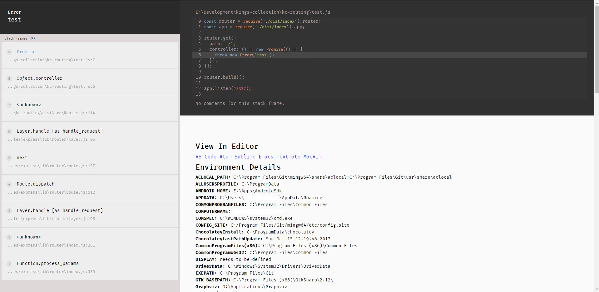

# KC Routing
*A router with error handlers for the kings collection*

[](https://travis-ci.com/kingga/kc-routing)

A strong typed router for the kings collection which is a set of classes which can be combined into one larger library. This router contains the basic HTTP route methods along with an express router wrapper and a JSON and Vue UI error handler (inspired by [[!Whoops for PHP](https://github.com/filp/whoops))

**NOTE: Ignore anything below this point as it may not be completely working as a module yet but it is an example of it's usage.**

## Installation

```bash
yarn add @kingga/kc-routing
# OR
npm i @kingga/kc-routing
```

## Error Handler Screenshot



## Usage

```typescript
import { Router, IRequest, HtmlResponse } from '@kingga/kc-routing';
import * as express from 'express';

const app = express();
const router = new Router(app);

router.get({
  path: '/',
  controller: () => Promise.resolve(new HtmlResponse('Hello, world!')),
});

class Controller {
  static index(request: IRequest): Promise<HtmlResponse> {
    return new Promise((resolve, reject) => {
      if (request.route('id') === '1') {
        resolve(new HtmlResponse('You found something!'));
      } else {
        reject(new Error('Whoops'));
      }
    })
  }
}

router.get({ path: '/posts', controller: Controller.index });

router.build();

app.listen(8080);
```
